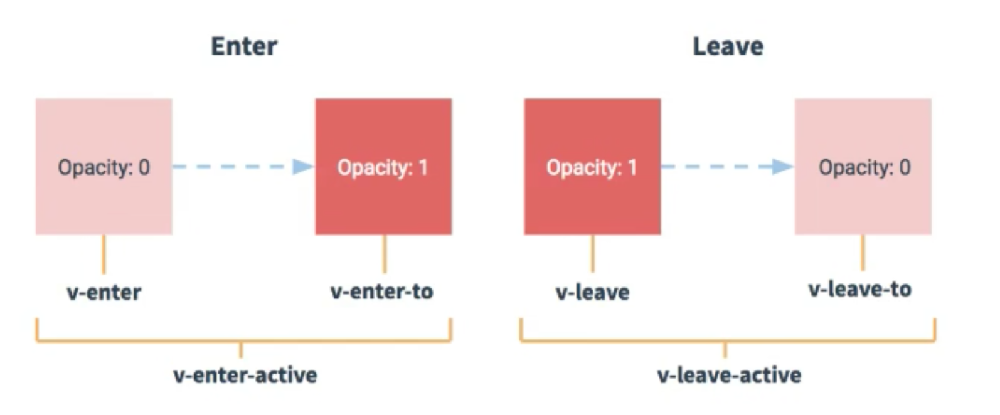

# 笔记
## 1.常用命令
- 1.先安装@vue/cli 安装命令：`npm install -g @vue/cli`
- 2.在命令行执行 `vue create project_name`
- 3.进入到project_name中执行 `npm run serve`
- 4.导出默认配置项 `vue inspect > output.js`

## 2.脚手架文件分析:
```
.
├── node_modules: 存放依赖模块
├── public
│	 ├── favicon.ico: 页签图标
│	 └── index.html: 主页面
├── src
│	 ├── App.vue: 汇总所有组件
│	 ├── assets: 存放静态资源
│			└── logo.png
│	 ├── components: 存放组件
│	 │		└── HelloWorld.vue
│	 └── main.js: 入口文件
├── README.md: 应用描述文件
├── babel.config.js: babel的配置文件
├── jsconfig.json
├── package-lock.json: 包版本控制文件
├── package.json: 应用包配置文件
└── vue.config.js: 配置文件
```

## 3.关于不同版本的Vue:
- vue.js与vue.runtime.xxx.js的区别：
    1.vue.js是完整版的Vue，包含：核心功能+模板解析器
    2.vue.runtime.xxx.js是运行版的Vue，只包含：核心功能，没有模板解析器
- 因为vue.runtime.xxx.js没有模板解析器，所以不能使用templete配置项，需要
    render函数接受到的createELement函数去指定具体内容

## 4.vue.config.js配置文件:
> 使用```vue inspect > output.js```可以查看到Vue脚手架的默认配置
> 使用```vue.config.js```可以对脚手架进行个性化定制，详情见：https://cli.vuejs.org/zh


## 5.ref属性
    1.被用来给元素或子组件注册引用信息(id的替代者)
    2.应用在html标签上获取的是真实DOM元素，应用在组件标签上是组件实例对象（vc）
    3.使用方式：
        打标识：<h1 ref="xxx">...</h1> 或者<WebSite ref='xxx'/>
        获取：this.$ref.xxx

## 6.配置项porps
    功能：让组件接受外部传过去的数据
        1.传递数据
            <Demo name='xxx' />
        2.接受数据：
            第一种方式(只接受)：
                props:['name']
            第二种方式(限制类型)：
                porps:{
                    name: String
                }
            第三种方式(限制类型，限制必要性，指定默认值):
                props:{
                    name:{
                        type: String,// 类型
                        required: true,// 必要性
                        default: '张三',// 默认值
                    }
                }
    备注：props是只读的，Vue底层会检测对props的修改，如果进行了修改，就会发出警告
        若业务需求确实需要修改，那么需要复制props的内容到data中一份，然后修改data中的数据

## 7.mixin(混入)
    功能：可以把多个组件公用的配置提取成一个混入对象
    使用方法：
        第一步:定义一个混入，例如：
            {
                data() { .... },
                methods: { ... },
                ...
            }
        第二步: 使用混入，例如：
            1.全局混入：Vue.mixin(xxx)
            2.局部混入：mixins:[ xxx ]

## 8.插件
    功能: 用于增强Vue
    本质: 包含install方法的一个对象，install的第一个参与是Vue，第二个以后的参数是插件使用者传递的数据。
    定义插件：
        对象.install = function(Vue, options) {
            // 1.添加全局过滤器
            Vue.filter(...)

            // 2.添加全局指令
            Vue.directive(...)

            // 3.配置全局混入
            Vue.mixin(...)

            // 4.添加实例方法
            Vue.prototype.$myMethod = function() {...}
            Vue.protoType.$myProperty = xxx
        }
    使用插件：Vue.user(xxx)
    
## 9.scoped样式
    作用：让样式在局部失效，防止冲突
        还可以使用less来定义局部样式，需要使用less-loader包
    写法：<stype scoped>


## 10.组件编码流程(通用)
    1.实现静态组件：抽取组件、使用组件实现静态页面效果
    2.展示动态数据：
        1.数据的类型、名称是什么
        2.数据保存在哪个组件
    3.交互---从绑定事件监听开始

## 11.父组件和子组件进行数据交互
    1.父组件给子组件传递数据
        直接使用porps方式传递即可
    2.子组件给父组件传递数据
        1.父组件先传递一个函数给子组件
        2.子组件使用porps方式接受该函数
        3.子组件调用传递下来的函数即可

## 12.webStorage
    1.存储内容大小一般支持5MB左右(不同浏览器可以还不一样)
    2.浏览器端通过 Window.sessionStorage和Window.localStorage属性来实现本地存储机制
    3.相关API：
        1.xxxStorage.setItem('key', value)
            该方法接受一个键和值作为参数，会把键值对添加到存储中，如果键存在，则更新对应的值
        2.xxxStorage.getItem('key')
            该方法接受一个键名作为参数，返回键名对应的值
        3.xxxStorage.removeItem('key')
            该方法接受一个键名作为参数，并把该键名从存储中删除
        4.xxxStorage.clear()
            该方法会清空存储中的所有数据
    4.备注：
        1.SessionStorage存储的内容会随着浏览器窗口关闭而消失
        2.LocalStorage存储的内容需要手动清除才会消失
        3.xxxStorage.getItem('key')如果key对应的value获取不到，那么getItem的返回值是null
        4.JSON.parse(null)的结果依然是null 

## 13.组件的自定义事件
    1.一种组件间通信的方式，适用于：子组件 ==> 父组件
    2.使用场景：A是父组件，B是子组件，B想给A传递数据，那么就要在A中给B绑定自定义事件(事件的回调在A中)
    3.绑定自定义事件：
        1.第一种方式，在父组件中：`<Demo @userInfo="test">`或者`<Demo v-on:userInfo="text"/>`
        2.第二种方式，在父组件中：
        ```
        <Demo ref='demo'/>
        .....
        mounted() {
            this.$refs.xxx.$on("userInfo", this.test)
        }
        ```
        3.若想让自定义事件只触发一次，可以使用`once`修饰符，或`$once`方法
    4.触发自定义事件: `this.$emit("userInfo", 数据)`
    5.解绑自定义事件: `this.$off('userInfo')`
    6.组件上也可以绑定原生DOM事件，需要使用`native`修饰符
    7.注意：通过 `this.$refs.xxx.$on("userInfo", 回调)`绑定自定义事件时，回调要么配置在methods中，要么用箭头函数，否则thid指向会出问题

## 14.全局事件总线(GlobalEventBus)
    1.一种组件间通信的方式，适用于任意组件间通信
    2.安装全局事件总线：
        ```
        new Vue({
            ...
            beforeCreate() {
                Vue.prototype.$bus = this // 安装全局事件总线，$bus就是当前应用的vm
            }
            ...
        })
        ```
    3.使用事件总线
        1.接受数据：A组件想接受数据，则在A组件中给$bus绑定自定义事件，事件的回调留在A组件自身。
            ```
            methods(){
                demo(data) {...}
            }
            ...
            mounted() {
                this.$bus.$on('xxx', this.demo) // 使用箭头函数也行
            }
            ```
        2.提供数据：``` this.$bus.$emit('xxx', 数据) ```
    4.最好在beforeDestroy钩子中，使用$off去解绑当前组件所用到的事件

## 15.消息订阅与发布(使用pubsub-js库)
    1.一种组件间通信方式，适用于任意组件通信
    2.使用步骤：
        1.安装pubsub： ``` npm i pubsub-js ```
        2.引入：``` import pubsub from 'pubsub-js' ```
        3.接受数据：A组件想接受数据，则在A组件中订阅消息，订阅的回调留在A组件自身
            ```
            methods() {
                demo(data) { ... }
            }
            ...
            mounted() {
                //回调函数要么写在methods里面,要么使用箭头函数
                this.pid = pubsub.subscribe('xxx', this.demo)
            }
            ```
        4.提供数据： ``` pubsub.publish('xxx', 数据) ```
        5.最好在beforeDestroy钩子中，用``` pubsub.unsubscribe(pid) ```去取消订阅

## 16.nextTick
    1.语法：``` this.$nextTick(回调函数) ```
    2.作用：在下一次DOM更新结束后执行指定的回调
    3.什么时候用：当改变数据后，要基于更新后的新DOM进行某些操作时，要在nextTick所指定的回调中执行

## 17.Vue封装的过度与动画
    1.作用：在插入、更新或移除DOM元素时，在合适的时候给元素添加样式类名
    2.图示：
    
    3.写法
        1.准备好样式：
            元素进入的样式：
                1.v-enter：进入的起点
                2.v-enter-active：进入过程中
                3.v-enter-to：进入的终点
            元素离开的样式：
                1.v-leave：离开的起点
                2.v-leave-active：离开过程中
                3.v-leave-to：离开的终点
        2.使用```<transition>```包裹要过度的元素，并配置name属性：
            ```
            <transition name='hello'>
                <h1 v-show='isShow'>你好啊</h1>
            </transition> 
            ```
        3.备注：
            若有多个元素需要过度，则需要使用: ```<transition-group ```，且每个元素都要指定```key```值

## 18.Vue脚手架配置代理
1.方法一

    在vue.congfig.js中添加如下配置:
    ```
    devServer: {
        proxy: "https://httpbin.org", // 指向远程服务器
    },
    ```
    说明：
        1.优点：配置简单，请求资源时直接发给前端即可
        2.缺点：不能配置多个代理，不能灵活的控制请求是否走代理
        3.工作方式：若按照上述代理，当请求了前端的资源时，那么该请求会转发给服务器(优先匹配前端资源)
2.方式二
    编写vue.config.js配置代理规则：

    module.exports = defineConfig({
        devServer: {
            proxy:{
                '/api1': { // 匹配所有以'/api1'开头的请求路径
                     target: "https://httpbin.org", // 代理目标的基础路径
                     pathRewrite: {'^/api1': ''},// 真正发起请求时，去掉这个前缀
                     changeOrigin: true,
                },
                '/api2': { 
                     target: "https://httpbin.org",
                     pathRewrite: {'^/api2': ''},
                     changeOrigin: true,
                }
            }
        }
    })
    /*
    changeOrigin：默认值为ture， 用于控制请求头中的host值 默认true
     */
     说明：
        1.优点：可以配置多个代理，且可以灵活的控制请求是否走代理
        2.缺点：配置略微繁琐，请求资源时必须加前缀

## 19.插槽
    1.作用：让父组件可以向子组件指定位置插入html结构,也是一种组件间通信的方式，适用于 父组件==>子组件。
    2.分类：默认插槽、具名插槽、作用于插槽
    3.使用方式：
        1.默认插槽
            ```
            父组件中：
                <Category>
                    <div>html结构1</div>
                </Category>
            子组件中：
                <template>
                    <div>
                        <!-- 定义插槽 -->
                        <slot>插槽默认内容</slot>
                    </div>
                <template>
            ```
        2.具名插槽
            ```
            父组件中：
                <Category>
                    <template slot="center">
                        <div>html结构1</div>
                    </template>
                    <template v-slot:footer>
                        <div>html结构2</div>
                    </template>
                </Category>
            子组件中：
                <template>
                    <div>
                        <!-- 定义插槽 -->
                        <slot name='center'>插槽默认内容</slot>
                        <slot name='footer'>插槽默认内容</slot>
                    </div>
                <template>
            ```
        3.作用于插槽
            1.理解：数据在组件的自身，但根据数据生成的结构需要组件的使用者来决定。（games数据在Category组件中，但使用数据所遍历出来的结构由App组件来决定）
            2.具体编码：
            ```
            父组件中：
            <CategoryList title="游戏" >
                <template slot-scope="data">
                    <!-- 生成的是ul列表 -->
                    <ul>
                    <li v-for="(game, index) in data.games" :key="index"> {{ game }} </li>
                    </ul>
                </template>
            </CategoryList>

            <CategoryList title="游戏">
                <template slot-scope="{games}">
                    <!-- 生成的是h4列表 -->
                    <h4 v-for="(game, index) in games" :key="index"> {{ game }} </h4>
                </template>
            </CategoryList>

            子组件中：
            <template>
                <div>
                    <!-- 定义一个插槽(挖个坑，等待组件的使用者来填充) -->
                    <slot :games="games">这是默认值，没有传递时会显示出来</slot>
                </div>
            </template>

            <script>
                export default {
                    name: "CategoryList",
                    data() {
                        return {
                            games: ["红色警戒", "穿越火线", "QQ劲舞团", "超级玛丽"],
                        }
                    },
                }
            </script>
            ```

## 19.Vuex
    1.概念
        在Vue中实现集中式状态(数据)管理的一个Vue插件，对Vue应用中多个组件的共享状态进行集中式管理(读/写),也是一种组件间通信的方式，且适用于任意组件间通信
    2.何时使用？
        多个组件需要共享数据时
    3.搭建Vuex环境
        1.创建文件：```src/store/index.js```
            ```
            // 引入Vue核心库
            import Vue from 'vue'
            // 引入Vuex
            import Vuex from 'vuex'

            // 使用Vuex
            Vue.use(Vuex)

            // 准备actions --- 用于相应组件中的动作
            const actions = {}
            // 准备mutations --- 用于操作数据（state）
            const mutations = {}
            // 准备state --- 用于存储数据
            const state = {}

            // 创建并导出(暴露)store
            export default new Vuex.Store({
                actions,
                mutations,
                state
            })
            ```
        2.在```main.js```中创建vum时传入```store```配置项
            ```
            //引入store
            import store from './store/index'

            // 创建vm
            new Vue({
                el: "#app",
                store,
                render: h => h(App)
            })
            ```
    4.基本使用
        1.初始化数据、配置```actions```,配置```mutations```,操作文件```store.js```
        ```
        // 引入Vue核心库
        import Vue from 'vue'
        // 引入Vuex
        import Vuex from 'vuex'

        // 使用Vuex
        Vue.use(Vuex)

        const actions = {
            add(context, value) {
                console.log("actions中的add被调用了");
                context.commit('ADD', value)
            },
        }

        const mutations = {
            ADD(state, value) { // 函数一般写成大写
                console.log("mutations中的ADD被调用了");
                state.sum += value
            },
        }

        // 准备state --- 用于存储数据
        const state = {
            // Vuex：第零部
            sum: 0 // 当前的合
        }

        // 创建并导出(暴露)store
        export default new Vuex.Store({
            actions,
            mutations,
            state
        })
        ```
        2.组件中读取vuex中的数据：
        ``` $store.state.sum ```
        3.组件中修改vuex中的数据：
        ``` $store.dispatch('action中的方法名', 数据) ```  或者
        ``` $store.commit('mutations中的方法名', 数据) ```
    备注：
        若没有网络请求或其他业务，组件中也可以越过actions，即不写dispatch,直接编写commit
    5.getter的使用
        1.概念：
            当state中的数据需要经过加工后使用时，可以使用getter加工
        2.在```store.js```中追加```getters```配置
        ```
        const getters = {
            bigSum(state) {
                return state.sum * 10
            }
        }

        // 创建并导出(暴露)store
        export default new Vuex.Store({
            state
        })
        ```
        3.组件中读取数据：``` $store.getters.bigSum ```
    6.4个map方法的使用
        1.mapState方法：用于帮助我们映射```state```中的数据为计算属性
        ```
        computed: {
            // 借助mapState生成计算属性，从state中读取数据 --（对象写法）
            // ...mapState({he: 'sum', xuexiao: 'school', xueke: 'subject'}),

            // 借助mapState生成计算属性，从state中读取数据 --（数组写法）
            ...mapState(['sum', 'school', 'subject']),
        }
        ```
        2.mapGetters方法：用于帮助我们映射```getter```中的数据为计算属性
        ```
        computed: {
            // 借助mapGetters生成计算属性，从getters中读取数据 --（对象写法）
            // ...mapGetters({bigSum: 'bigSum'}),
      
            // 借助mapGetters生成计算属性，从getters中读取数据 --（数组写法）
            ...mapGetters(['bigSum']),
        }
        ```
        3.mapActions:用于帮助我们生成``` actions ```对话的方法，即包含``` $store.dispatch(xxx) ```的函数
        ```
        // 借助mapActions生成对应的方法，方法中会调用dispatch去联系actions -- (对象写法)
        // ...mapActions({incrementOdd: 'addOdd', incrementWait: 'addWait'})

        // 借助mapActions生成对应的方法，方法中会调用dispatch去联系actions -- (数组写法)
        ...mapActions(['addOdd', 'addWait'])
        ```
        4.mapMutations:用于帮助我们生成``` mutations ```对话的方法，即包含``` $store.commit(xxx) ```的函数
        ```
        computed: {
            // 借助mapMutations生成对应的方法，方法中会调用commit去联系mutations -- (对象写法)
            ...mapMutations({increment: 'ADD', decrement: 'SUB'}),
      
            // 借助mapMutations生成对应的方法，方法中会调用commit去联系mutations -- (对象写法)
            // ...mapMutations(['ADD', 'SUB']),
        }
        ```
    备注：mapMutations与mapActions使用时，若需要传递参数，需要在模板中绑定事件时传递好参数，否则参数是事件对象。
    7.模块化+命名空间
        1.目的：让代码更好维护，让多种数据分类更加明确
        2.修改```store.js```
            ```
            const countAbout = {
                namespaced: true, //开启命名空间
                actions:{ ... },
                mutations:{ ... },
                state:{
                    x: 0, 
                },
                getters:{
                    bigSum(state) {
                        return state.sum * 10
                    }
                },
            }
            const countAbout = {
                namespaced: true, //开启命名空间
                actions:{ ... },
                mutations:{ ... },
                state:{ ... },
            }

            export default new Vuex.Store({
                modules: {
                    countAbout,
                    personAbout,
                }
            })
            ```
        3.开启命名空间后，组件中读取state数据
            ```
            方式一: 自己直接读取
            this.$store.state.personList.list
            方式二: 借助mapState
            ...mapState('countAbout', ['sum', 'school', 'subject'])
            ```
        4.开启命名空间后,组件中读取getters数据
            ```
            方式一:自己直接读取
            this.$store.getters["personAbout/firstPersonName"]
            方式二: 借助mapGetters
            ...mapGetters('countAbout', ['bigSum']),
            ```
        5.开启命名空间后,组件中调用dispatch
            ```
            方式一:自己直接读取
            this.$store.dispatch('personAbout/addPersonWang', personObj)
            方式二: 借助mapActions
            ...mapActions('countAbout', ['addOdd', 'addWait'])
            ```
        6.开启命名空间后，组件中调用commit
            ```
            方式一:自己直接读取
            this.$store.commit('personAbout/ADD_PERSON', personObj)
            方式二: 借助mapMutations
            ...mapMutations('countAbout', {increment: 'ADD', decrement: 'SUB'}),
            ```
## 18.路由
    1.理解：一个路由(route)就是一组映射关系(key-value)，多个路由需要路由器(router)进行管理
    2.前端路由：key是路径，value是组件
    3.基本使用
        1.安装vue-router，命令``` npm i vue-router ```
        2.应用插件：```Vue.use(VueRouter)```
        3.编写router配置
            ```
            // 引入vuerouter
            import VueRouter from "vue-router"

            // 引入组件
            import About from '../components/About.vue'
            import Home from '../components/Home.vue'

            // 创建并暴露一个路由器
            export default new VueRouter({
                routes: [
                    {
                        path: '/about',
                        component: About
                    },
                    {
                        path: '/home',
                        component: Home
                    },
                ]
            })
            ```
        4.实现切换(active-class可配置高亮样式)
        ```
        <router-link class="list-group-item" active-class="active" to="/about">About</router-link>
        <router-link class="list-group-item" active-class="active" to="/home">Home</router-link>
        ```
        5.指定展示位置
        ```
        <!-- 指定组件的呈现位置 -->
        <router-view></router-view>
        ```
    4.几个注意点：
        1.路由组件通常存放在```pages```文件夹，一般组件通常存放在```components```文件夹
        2.通过切换，“隐藏”了的路由组件，默认是被销毁的，需要的时候再去挂载
        3.每个组件都有自己的```$route```,里面存储着自己的路由信息
        4.整个应用只有一个router，可以通过组件的```$router```属性获取到
    5.嵌套(多级)路由
        1.配置路由规则，使用children配置项
        ```
        routes: [
            {
                path: '/about',
                component: About
            },
            {
                path: '/home',
                component: Home,
                children:[ // 通过children配置子级路由
                    {
                        path: 'news',//此处一定不要写： /news
                        component: News,
                    },
                    {
                        path: 'message',//此处一定不要写： /message
                        component: Message,
                    },
                ],
            },
        ]
        ```
        2.跳转(要写完整路径)
        ```
        <router-link to="/home/news">News</router-link>
        ```
    6.路由的query参数
        1.传递参数
        ```
        <!-- 跳转路由并携带query参数，to的字符串写法 -->
        <!-- <router-link :to="`/home/message/detail?id=${obj.id}&title=${obj.title}`">跳转</router-link> -->

        <!-- 跳转路由并携带query参数，to的对象写法  推荐写法-->
        <router-link :to="{
            path: '/home/message/detail',
            query:{
                id: obj.id,
                title:obj.title
            }
        }">
            跳转
        </router-link>
        ```
        2.接受参数
        ```
        this.$route.query.id
        this.$route.query.title
        ```
    7.命名路由
        1.作用：可以简化路由的跳转
        2.如何使用：
            1.给路由命名
            ```
            {
                    path: 'message',
                    component: Message,
                    children:[
                        {
                            name: "detail", //路由命名
                            path: 'detail',
                            component: Detail,
                        }
                    ]
                },
            ```
            2.简化跳转：
            ```
            <!--简化跳转前-->
            <router-link to='message/detail'>跳转</router-link>
            
            <!--简化跳转后-->
            <router-link :to="{name:'detail'}"">跳转</router-link>
            
            <!--简化写法配合传递参数-->
            <router-link
            :to="{
                name:'detail',
                query: {
                    id:123,
                    title:'你好'
                }
            }">
            跳转
            </router-link>
            ```
    8.路由的params参数
        1.配置路由，声明接受param参数
        ```
        {
            path: 'message',
            component: Message,
            children:[
                {
                    name: "detail", //路由命名
                    path: 'detail/:id/:title', //使用占位符声明接受params参数
                    component: Detail,
                }
            ]
        },
        ```
        2.传递参数
        ```
        <!-- 跳转路由并携带params参数，to的字符串写法 -->
        <router-link :to="`/home/message/detail/${obj.id}/${obj.title}`">跳转</router-link>

        <!-- 跳转路由并携带params参数，to的对象写法  推荐写法-->
        <router-link :to="{
            name: 'detail', // 使用params传递参数时，必须使用name，不能用path
            params:{
                id: obj.id,
                title:obj.title
            }
        }">
            跳转
        </router-link>
        ```
        特别注意：
            路由携带params参数时，若使用to的对象写法，则不能使用path配置项，必须使用name配置
        3.接受参数：
        ```
        this.$route.params.id
        this.$route.params.title
        ```
    9.路由的props的配置
        作用：让路由组件更方便的收到参数
        ```
        {
            name: "detail",
            path: 'detail/:id/:title', // 配置params参数
            component: Detail,
            // props的第一种写法，值为对象，该对象中的所有key-value都会以props的形式传递给Detail组件
            // props: { a: 111, b: "Hello" }

            // props的第二种写法，值为布尔值,若布尔值为ture，就会把该路由组件收到的所有params参数，以props的形式传递给Detail组件
            // props: true

            // props的第三种写法，值为函数
            props($router) { // 原始写法
                return {
                    id: $router.query.id,
                    title: $router.query.title,
                }
            },
            // props({query:{id, title}}) { // 结构赋值
            //     return {id, title}
            // },
        }
        ```
    10.<router-link>的replace属性
        1.作用：控制路由跳转时操作浏览器历史记录的模式
        2.浏览器的历史有两种写入方式：分别为‘push’和‘replace’，‘push’是追加历史记录，‘replace’是替换当前记录，路由跳转时候默认为‘push’
        3.如何开启：‘replace’模式：``` <router-link replace ...>News</router-link> ```
    


    
    

    


